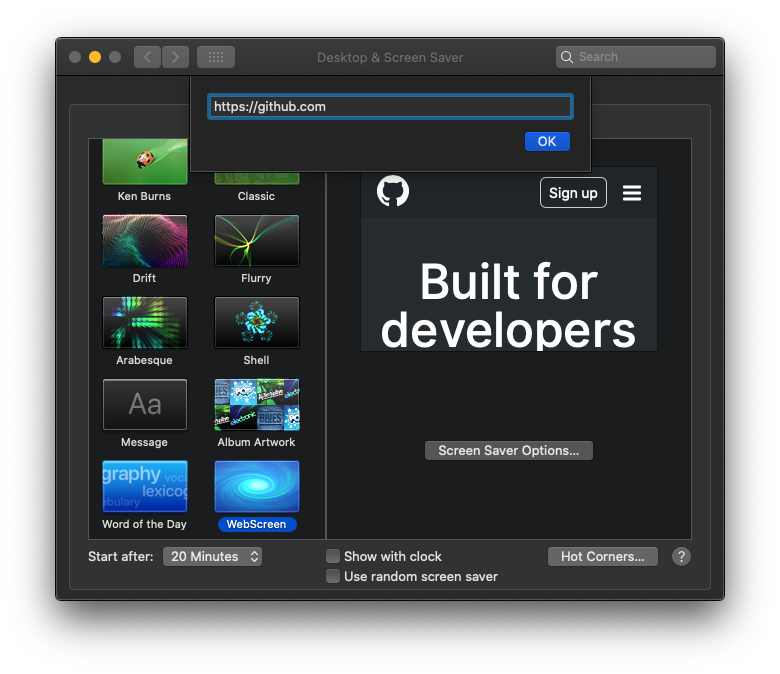

# WebScreen

- macOS screen saver displays a web page.

## Installation

1. See the [releases page](https://github.com/ymatzki/WebScreen/releases)
1. Download the latest image.
1. Unzip downloaded file.
1. Double click `WebScreen.saver`.
